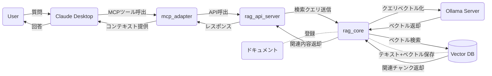

# Architecture

```mermaid
flowchart LR
    %% ノード定義
    User(User)
    Claude(Claude Desktop)
    MCP(mcp_adapter)
    API(rag_api_server)
    Core(rag_core)
    Ollama(Ollama Server)
    VDB[(Vector DB)]
    Doc(ドキュメント)

    %% 質問・回答フロー
    User -->|質問| Claude
    Claude -->|MCPツール呼出| MCP
    MCP -->|API呼出| API
    API -->|検索クエリ送信| Core
    Core -->|クエリベクトル化| Ollama
    Ollama -->|ベクトル返却| Core
    Core -->|ベクトル検索| VDB
    VDB -->|関連チャンク返却| Core
    Core -->|関連内容返却| API
    API -->|レスポンス| MCP
    MCP -->|コンテキスト提供| Claude
    Claude -->|回答| User

    %% ドキュメント登録フロー
    Doc -.-|登録| Core
    Core -.-|テキスト+ベクトル保存| VDB
```
