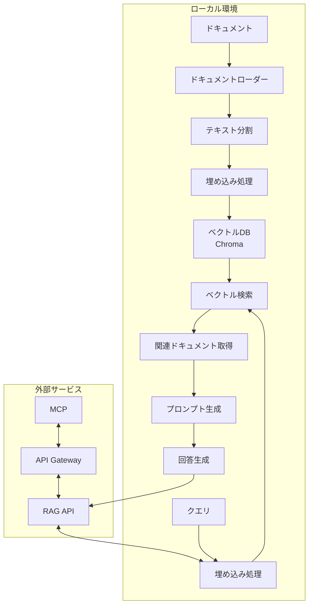

# RAG実装詳細設計

## 目的

本ドキュメントでは、RAG（Retrieval-Augmented Generation）システムの詳細設計について記載します。前回の調査ドキュメント（[001-RAG実装調査.md](001-RAG実装調査.md)）で検討した技術スタックを基に、具体的な実装方法と構成について詳細を定義します。

## システム構成図



## 技術コンポーネント詳細

### 1. LangChain.js

LangChain.jsは、フレームワークとしてRAGの各コンポーネントを統合するために使用します。

**バージョン情報**:
- langchain: ^0.2.0
- @langchain/openai: ^0.0.6（OpenAIスタイルのAPIインターフェース用）
- @langchain/community: ^0.0.20（ローダーと各種コネクタ用）

### 2. 埋め込みモデル

pfnet/plamo-embedding-1bは日本語対応の埋め込みモデルで、LM Studioを介してローカルで実行します。

**特性**:
- 埋め込みサイズ: 1024次元
- 言語サポート: 日本語と英語のバイリンガル対応
- コンテキスト長: 8192トークン
- ファイルサイズ: 約1.62GB

### 3. ベクトルデータベース

Chromaをベクトルデータベースとして使用します。軽量で、Node.js環境と相性が良いためです。

**設定情報**:
- @langchain/community: Chromaクライアント提供
- chromadb: PythonのChromaDBサーバー（オプション）
- 保存形式: ローカルファイルシステム
- 検索アルゴリズム: コサイン類似度

### 4. MCP連携

MCPとの連携にはRESTful APIを提供します。

**API仕様**:
- エンドポイント: `/api/query`
- メソッド: POST
- リクエストボディ:
  ```json
  {
    "query": "質問文",
    "project_context": "プロジェクト識別子",
    "max_results": 5
  }
  ```
- レスポンス:
  ```json
  {
    "answer": "生成された回答",
    "sources": [
      {
        "title": "参照ドキュメント名",
        "content": "参照内容",
        "relevance_score": 0.92
      }
    ]
  }
  ```

## 実装コード例

### 1. 基本的なプロジェクト構成

```
/mcp-rag/
├── src/
│   ├── config/
│   │   └── index.js       # 設定ファイル
│   ├── loaders/           # ドキュメントローダー
│   │   ├── markdown.js
│   │   ├── pdf.js
│   │   └── index.js
│   ├── embeddings/        # 埋め込み処理
│   │   └── plamo.js
│   ├── vectorstore/       # ベクトルストア
│   │   └── chroma.js
│   ├── rag/               # RAG実装
│   │   ├── index.js
│   │   ├── processor.js
│   │   └── prompt.js
│   ├── api/               # API実装
│   │   ├── routes.js
│   │   └── server.js
│   └── index.js           # エントリーポイント
├── docs/                  # プロジェクトドキュメント
├── scripts/               # ユーティリティスクリプト
│   ├── index-docs.js      # ドキュメントインデックス作成
│   └── test-query.js      # クエリテスト
└── package.json
```

### 2. LM Studioによる埋め込みモデル設定

LM Studioを使用してplamo-embedding-1bモデルをローカルで実行し、OpenAI互換のAPIエンドポイントとして提供します。設定方法は以下の通りです：

1. LM Studioをダウンロードしてインストール
2. Settings > Local Serverタブで以下を設定:
   - Embedding Model: plamo-embedding-1b
   - 「Enable Embedding Model API」をオン
   - Server Port: 1234（デフォルト）
3. 「Start Server」をクリックしてサーバーを起動

### 3. ドキュメント処理コード例

以下は、Markdownドキュメントをロードし、チャンク分割して埋め込みを生成するコード例です：

```javascript
// src/loaders/markdown.js
const { DirectoryLoader } = require("langchain/document_loaders/fs/directory");
const { TextLoader } = require("langchain/document_loaders/fs/text");
const { RecursiveCharacterTextSplitter } = require("langchain/text_splitter");

// Markdownファイルを含むディレクトリからドキュメント読み込み
async function loadMarkdownDocuments(directoryPath) {
  const loader = new DirectoryLoader(
    directoryPath,
    {
      ".md": (path) => new TextLoader(path)
    }
  );
  
  const docs = await loader.load();
  console.log(`Loaded ${docs.length} markdown documents`);
  return docs;
}

// テキスト分割処理
async function splitDocuments(documents) {
  const textSplitter = new RecursiveCharacterTextSplitter({
    chunkSize: 1000,
    chunkOverlap: 200,
  });
  
  const splitDocs = await textSplitter.splitDocuments(documents);
  console.log(`Split into ${splitDocs.length} chunks`);
  return splitDocs;
}

module.exports = {
  loadMarkdownDocuments,
  splitDocuments,
};
```

### 4. Plamo埋め込みモデル連携

```javascript
// src/embeddings/plamo.js
const { Embeddings } = require("langchain/embeddings/base");
const axios = require("axios");

class PlamoEmbeddings extends Embeddings {
  constructor(config = {}) {
    super();
    this.modelName = config.modelName || "plamo-embedding-1b";
    this.batchSize = config.batchSize || 8;
    this.apiUrl = config.apiUrl || "http://localhost:1234/v1/embeddings";
  }

  async embedDocuments(texts) {
    const embeddings = [];
    
    // バッチ処理
    for (let i = 0; i < texts.length; i += this.batchSize) {
      const batch = texts.slice(i, i + this.batchSize);
      const batchEmbeddings = await Promise.all(
        batch.map((text) => this.embedQuery(text))
      );
      embeddings.push(...batchEmbeddings);
    }
    
    return embeddings;
  }

  async embedQuery(text) {
    try {
      const response = await axios.post(
        this.apiUrl,
        {
          input: text,
          model: this.modelName,
        }
      );
      
      return response.data.data[0].embedding;
    } catch (error) {
      console.error("Error calling Plamo embedding API:", error);
      throw error;
    }
  }
}

module.exports = { PlamoEmbeddings };
```

### 5. Chromaベクトルストア設定

```javascript
// src/vectorstore/chroma.js
const { Chroma } = require("langchain/vectorstores/chroma");
const { PlamoEmbeddings } = require("../embeddings/plamo");

async function createVectorStore(documents, collectionName) {
  // PlaMo埋め込みモデルの初期化
  const embeddings = new PlamoEmbeddings();
  
  // Chromaベクトルストアの作成
  const vectorStore = await Chroma.fromDocuments(
    documents,
    embeddings,
    {
      collectionName: collectionName,
      url: "http://localhost:8000", // ChromaDBサーバーを使用する場合
      collectionMetadata: {
        "hnsw:space": "cosine" // 類似度計算方法
      }
    }
  );
  
  console.log(`Created vector store with collection name: ${collectionName}`);
  return vectorStore;
}

async function loadExistingVectorStore(collectionName) {
  const embeddings = new PlamoEmbeddings();
  
  // 既存のベクトルストアをロード
  const vectorStore = await Chroma.fromExistingCollection(
    embeddings,
    { collectionName }
  );
  
  return vectorStore;
}

module.exports = {
  createVectorStore,
  loadExistingVectorStore,
};
```

### 6. RAG実装の統合

```javascript
// src/rag/processor.js
const { loadMarkdownDocuments, splitDocuments } = require("../loaders/markdown");
const { createVectorStore, loadExistingVectorStore } = require("../vectorstore/chroma");

// ドキュメントのインデックス作成
async function indexDocuments(directoryPath, collectionName) {
  // ドキュメントのロード
  const documents = await loadMarkdownDocuments(directoryPath);
  
  // テキスト分割
  const splitDocs = await splitDocuments(documents);
  
  // ベクトルストア作成
  const vectorStore = await createVectorStore(splitDocs, collectionName);
  
  return vectorStore;
}

// クエリ処理
async function processQuery(query, collectionName, maxResults = 5) {
  // ベクトルストアのロード
  const vectorStore = await loadExistingVectorStore(collectionName);
  
  // 類似文書の検索
  const searchResults = await vectorStore.similaritySearch(query, maxResults);
  
  return searchResults;
}

module.exports = {
  indexDocuments,
  processQuery,
};
```

### 7. API実装

```javascript
// src/api/server.js
const express = require("express");
const cors = require("cors");
const { processQuery } = require("../rag/processor");

const app = express();
app.use(express.json());
app.use(cors());

// RAGクエリエンドポイント
app.post("/api/query", async (req, res) => {
  try {
    const { query, project_context, max_results = 5 } = req.body;
    
    if (!query) {
      return res.status(400).json({ error: "Query is required" });
    }
    
    // 関連ドキュメントの検索
    const searchResults = await processQuery(
      query,
      project_context || "default", 
      max_results
    );
    
    // 回答フォーマットの構築
    const sources = searchResults.map(doc => ({
      title: doc.metadata.source || "Unknown",
      content: doc.pageContent,
      relevance_score: doc.metadata.score || 1.0
    }));
    
    // ここに回答生成ロジックを追加予定
    // （今回はLM Studioなどのローカルモデルを使用）
    
    return res.json({
      answer: "生成された回答はここに表示されます",
      sources
    });
  } catch (error) {
    console.error("Error processing query:", error);
    return res.status(500).json({ error: "Internal server error" });
  }
});

const PORT = process.env.PORT || 3000;
app.listen(PORT, () => {
  console.log(`RAG API server running on port ${PORT}`);
});

module.exports = app;
```

## 実装における注意点

### 1. パフォーマンス最適化

- **バッチ処理**: 大量のドキュメントを処理する場合は、バッチ処理を実装して、メモリ使用量を抑える
- **モデル量子化**: plamo-embedding-1bモデルをより軽量化するために、量子化バージョンを検討
- **キャッシュ機構**: 頻繁に使用される埋め込みをキャッシュして計算コストを削減

### 2. エラーハンドリング

- **埋め込みモデルの異常**: LM Studioサーバーが停止している場合のフォールバック
- **ドキュメントパース失敗**: 様々な形式のドキュメント処理における例外処理
- **リトライ機構**: 一時的な障害から回復するためのリトライロジック

### 3. セキュリティ考慮事項

- **APIアクセス制限**: RAG APIへのアクセス制御
- **入力検証**: ユーザー入力のサニタイズによるインジェクション攻撃防止
- **機密情報フィルタリング**: 出力に機密情報が含まれないようにする仕組み

## 今後の検討事項

1. **インデックス更新メカニズム**: ドキュメントが更新された場合の差分インデックス更新
2. **複数言語対応**: 日本語以外の言語への対応
3. **評価メトリクス**: RAGシステムの性能を評価するためのメトリクス設計
4. **UI開発**: 開発者向けのRAG管理インターフェース

## 参考リソース

- [LangChain.js ドキュメント](https://js.langchain.com/docs/)
- [LM Studio - ローカルLLMおよび埋め込みモデルの実行](https://lmstudio.ai/)
- [plamo-embedding-1b モデルHuggingFaceページ](https://huggingface.co/pfnet/plamo-embedding-1b)
- [Chroma ベクトルデータベース](https://www.trychroma.com/)
