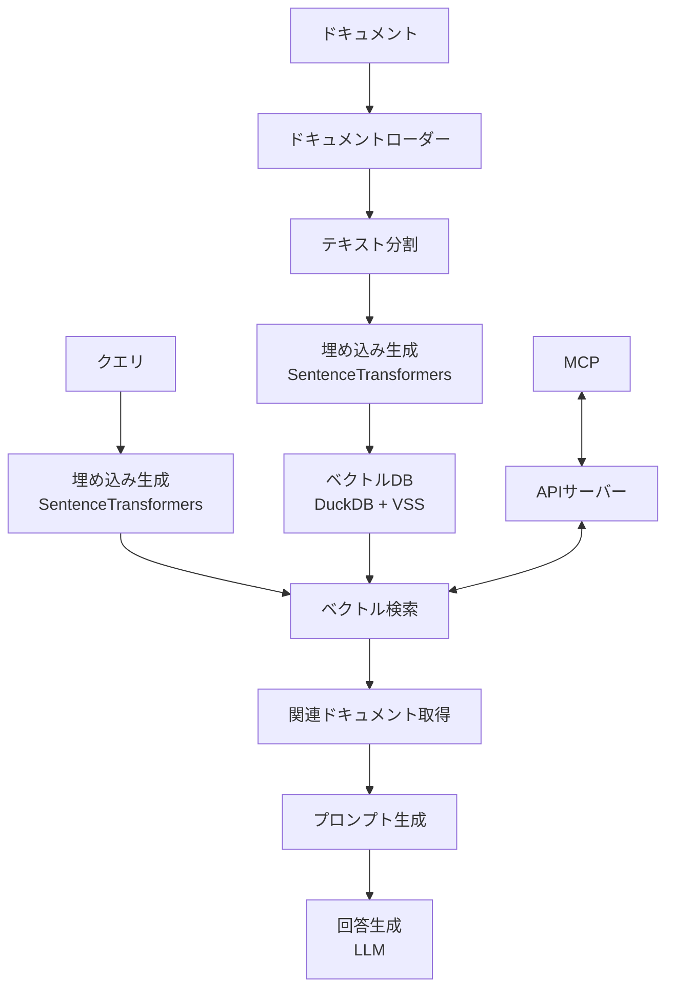

# Python版RAG実装の技術選定

## 目的

本ドキュメントでは、前回の調査に基づいてJavaScriptからPythonへの技術選定見直しを行い、ローカル環境で実行可能なRAG（Retrieval-Augmented Generation）システムの実装に適した技術スタックを選定します。

## 技術スタック選定

### 1. フレームワーク選定: LangChain (Python)

LangChain.jsからLangChain Pythonへの移行には以下の利点があります：

- **豊富な機能と統合**: LangChainのPythonバージョンは、JavaScriptバージョンよりも長い開発期間を経ており、より多くの機能と統合が提供されています。特にドキュメントローダー、テキスト分割、ベクトルストアの統合に関しては豊富なオプションがあります。
- **コミュニティとサポート**: Pythonバージョンの方がコミュニティが大きく、問題解決のためのリソースも豊富です。
- **機械学習エコシステム**: PythonはNumPy、PyTorch、HuggingFaceなどの機械学習ライブラリが豊富で、埋め込みモデルとの連携が容易です。

**必要なパッケージ**:
```
langchain>=0.2.0
langchain-text-splitters
langchain-community
```

### 2. 埋め込みモデル選定: SentenceTransformers

日本語に対応した埋め込みモデルとして、SentenceTransformersフレームワークを使用します。以下のような選択肢があります：

1. **all-MiniLM-L6-v2**:
   - 軽量で高性能なマルチリンガルモデル
   - 埋め込みサイズ: 384次元
   - 日本語を含む多言語対応
   - サイズが小さいため速度が速い

2. **paraphrase-multilingual-MiniLM-L12-v2**:
   - 多言語モデルで日本語もサポート
   - 埋め込みサイズ: 384次元
   - 50以上の言語に対応

3. **BAAI/bge-small-ja**:
   - 日本語特化型モデル
   - 埋め込みサイズ: 512次元
   - 日本語テキストの類似性検索に最適化

**実装方法**:
```python
from langchain_community.embeddings import HuggingFaceEmbeddings

# 多言語モデル（日本語含む）
embeddings = HuggingFaceEmbeddings(
    model_name="sentence-transformers/all-MiniLM-L6-v2"
)

# または日本語特化型
embeddings = HuggingFaceEmbeddings(
    model_name="BAAI/bge-small-ja"
)
```

### 3. ベクトルデータベース選定: DuckDB + VSS

ローカル環境で実行可能なベクトルデータベースの候補として、以下を比較検討しました：

| ベクトルDB | 特徴 | ローカル実行 | Python統合 | 永続化 | フィルタリング |
|------------|------|------------|------------|--------|--------------|
| **DuckDB + VSS** | 高速なクエリ処理とベクトル検索を統合 | ✅ | ✅ | ✅ | ✅ |
| **FAISS** | 高速な類似検索 | ✅ | ✅ | 制限あり | ❌ |
| **Qdrant** | 高機能だが複雑 | ✅ | ✅ | ✅ | ✅ |

評価の結果、以下の理由からDuckDB + VSSを選定します：

- **SQLベースの柔軟性**: 標準SQLを使用してクエリを記述可能
- **ローカル実行の容易さ**: シンプルなセットアップ
- **パフォーマンス**: 高速なベクトル検索と分析機能の統合

**実装方法**:
```python
import duckdb

# 接続とテーブル作成
conn = duckdb.connect('vectors.duckdb')
conn.execute('''
CREATE TABLE IF NOT EXISTS documents (
    id VARCHAR PRIMARY KEY,
    content TEXT,
    metadata JSON,
    embedding FLOAT[]
);
''')

# 埋め込みベクトルの挿入
for i, doc in enumerate(chunks):
    vector = embeddings.embed_query(doc.page_content)
    conn.execute(
        "INSERT INTO documents VALUES (?, ?, ?, ?)",
        [f"doc_{i}", doc.page_content, json.dumps(doc.metadata), vector]
    )

# ベクトル検索のインデックス作成
conn.execute("CREATE INDEX vector_idx ON documents USING HNSW (embedding);")
```

## 実装アーキテクチャ

### 1. システム構成図



### 2. ドキュメント処理パイプライン

1. **ドキュメントロード**:
   - Markdown、PDF、テキストファイルなどの多様なフォーマットに対応
   - 複数のソースからのデータ統合

2. **テキスト分割**:
   - `RecursiveCharacterTextSplitter`を使用した効果的なチャンク分割
   - 日本語特有の文章構造に配慮した分割設定

3. **埋め込み生成**:
   - SentenceTransformersを使用した高品質な埋め込み
   - バッチ処理による効率的な変換

4. **ベクトルストア構築**:
   - 埋め込みとメタデータの保存
   - カスタム検索パラメータの設定

### 3. クエリ処理パイプライン

1. **クエリ埋め込み**:
   - ユーザークエリの埋め込み生成
   - 必要に応じたクエリ拡張/リフォーマット

2. **関連ドキュメント検索**:
   - 類似性検索による関連チャンクの取得
   - MMRによる多様性を考慮した検索（オプション）

3. **コンテキスト生成**:
   - 検索結果の統合と最適化
   - プロンプトテンプレートへの組み込み

4. **回答生成**:
   - ローカルまたはリモートLLMによる最終回答生成
   - ソース引用の生成

## 実装コード例

### 1. プロジェクト構成

```
/mcp-rag/
├── requirements.txt      # 依存パッケージリスト
├── src/
│   ├── config.py         # 設定ファイル
│   ├── loaders/          # ドキュメントローダー
│   │   ├── markdown.py
│   │   ├── pdf.py
│   │   └── __init__.py
│   ├── embeddings.py     # 埋め込みモデル設定
│   ├── vectorstore.py    # ベクトルストア設定
│   ├── rag/              # RAG実装
│   │   ├── processor.py  # メイン処理ロジック
│   │   ├── prompts.py    # プロンプトテンプレート
│   │   └── __init__.py
│   ├── api/              # API実装
│   │   ├── routes.py
│   │   ├── server.py
│   │   └── __init__.py
│   └── main.py           # エントリーポイント
├── scripts/              # ユーティリティスクリプト
│   ├── index_docs.py     # ドキュメントインデックス作成
│   └── query_test.py     # クエリテスト
└── data/                 # データディレクトリ
    └── docs/             # インデックス化するドキュメント
```

### 2. 基本設定とドキュメントローダー

```python
# src/config.py
import os
from pathlib import Path

# ベースディレクトリ
BASE_DIR = Path(__file__).parent.parent

# データディレクトリ
DATA_DIR = BASE_DIR / "data"
DOCS_DIR = DATA_DIR / "docs"

# ベクトルストア設定
VECTOR_STORE_DIR = BASE_DIR / "vectorstore"
COLLECTION_NAME = "project_docs"

# 埋め込みモデル設定
EMBEDDING_MODEL = "sentence-transformers/all-MiniLM-L6-v2"

# テキスト分割設定
CHUNK_SIZE = 1000
CHUNK_OVERLAP = 200

# サーバー設定
API_HOST = "localhost"
API_PORT = 3000
```

### 3. ドキュメント処理とインデックス作成

```python
# src/loaders/markdown.py
from langchain_community.document_loaders import DirectoryLoader, TextLoader
from langchain_text_splitters import RecursiveCharacterTextSplitter
from pathlib import Path

def load_markdown_documents(directory_path):
    """ディレクトリからMarkdownドキュメントをロードする"""
    loader = DirectoryLoader(
        directory_path,
        glob="**/*.md",
        loader_cls=TextLoader
    )
    
    docs = loader.load()
    print(f"Loaded {len(docs)} markdown documents")
    return docs

def split_documents(documents, chunk_size=1000, chunk_overlap=200):
    """ドキュメントをチャンクに分割する"""
    text_splitter = RecursiveCharacterTextSplitter(
        chunk_size=chunk_size,
        chunk_overlap=chunk_overlap,
        separators=["\n\n", "\n", "。", "、", " ", ""],
        add_start_index=True
    )
    
    split_docs = text_splitter.split_documents(documents)
    print(f"Split into {len(split_docs)} chunks")
    return split_docs
```

## 実装における注意点

### 1. パフォーマンス最適化

- **バッチ処理**: 大量のドキュメントを処理する場合は、バッチ処理を実装してメモリ使用量を抑える
- **モデル量子化**: 必要に応じて埋め込みモデルを量子化し、より高速な推論を実現
- **キャッシュ機構**: 頻繁にアクセスされるクエリ結果をキャッシュして計算コストを削減

### 2. 日本語処理の最適化

- **トークン化**: 日本語に適したトークナイザーを使用し、適切な分割を行う
- **テキスト分割**: 日本語の文章構造を考慮した分割設定（句点や読点での分割など）
- **埋め込みモデル選択**: 日本語に特化した埋め込みモデルの検討

### 3. セキュリティ考慮事項

- **APIアクセス制限**: RAG APIへのアクセス制御と認証
- **入力検証**: クエリ入力のサニタイズによるインジェクション攻撃防止
- **機密情報フィルタリング**: 出力に機密情報が含まれないようにするフィルタリング機構

## 今後の検討事項

1. **最適な埋め込みモデルの選定**: 日本語特化型モデルと多言語モデルのベンチマーク比較
2. **MCPとの統合方法**: RESTful API、Webhookなど、最適な連携方法の検証
3. **評価方法の確立**: RAGシステムの性能を定量的に評価するための指標と手法の調査

## 参考資料

1. [LangChain Python ドキュメント](https://python.langchain.com/docs/)
2. [SentenceTransformers ドキュメント](https://www.sbert.net/)
3. [DuckDB公式ドキュメント](https://duckdb.org/)
4. [Hugging Face Embeddings](https://huggingface.co/blog/embeddings)
5. [Vector Database Benchmarks](https://qdrant.tech/benchmarks/)
