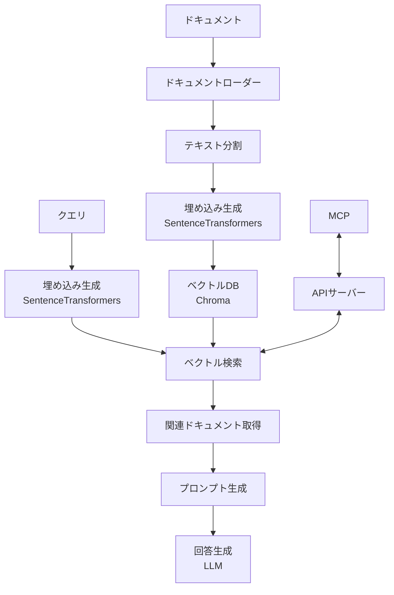

# Python版RAG実装の技術選定

## 目的

本ドキュメントでは、前回の調査に基づいてJavaScriptからPythonへの技術選定見直しを行い、ローカル環境で実行可能なRAG（Retrieval-Augmented Generation）システムの実装に適した技術スタックを選定します。

## 技術スタック選定

### 1. フレームワーク選定: LangChain (Python)

LangChain.jsからLangChain Pythonへの移行には以下の利点があります：

- **豊富な機能と統合**: LangChainのPythonバージョンは、JavaScriptバージョンよりも長い開発期間を経ており、より多くの機能と統合が提供されています。特にドキュメントローダー、テキスト分割、ベクトルストアの統合に関しては豊富なオプションがあります。
- **コミュニティとサポート**: Pythonバージョンの方がコミュニティが大きく、問題解決のためのリソースも豊富です。
- **機械学習エコシステム**: PythonはNumPy、PyTorch、HuggingFaceなどの機械学習ライブラリが豊富で、埋め込みモデルとの連携が容易です。

**必要なパッケージ**:
```
langchain>=0.2.0
langchain-text-splitters
langchain-community
```

### 2. 埋め込みモデル選定: SentenceTransformers

日本語に対応した埋め込みモデルとして、SentenceTransformersフレームワークを使用します。以下のような選択肢があります：

1. **all-MiniLM-L6-v2**:
   - 軽量で高性能なマルチリンガルモデル
   - 埋め込みサイズ: 384次元
   - 日本語を含む多言語対応
   - サイズが小さいため速度が速い

2. **paraphrase-multilingual-MiniLM-L12-v2**:
   - 多言語モデルで日本語もサポート
   - 埋め込みサイズ: 384次元
   - 50以上の言語に対応

3. **BAAI/bge-small-ja**:
   - 日本語特化型モデル
   - 埋め込みサイズ: 512次元
   - 日本語テキストの類似性検索に最適化

**実装方法**:
```python
from langchain_community.embeddings import HuggingFaceEmbeddings

# 多言語モデル（日本語含む）
embeddings = HuggingFaceEmbeddings(
    model_name="sentence-transformers/all-MiniLM-L6-v2"
)

# または日本語特化型
embeddings = HuggingFaceEmbeddings(
    model_name="BAAI/bge-small-ja"
)
```

### 3. ベクトルデータベース選定: Chroma

ローカル環境で実行可能なベクトルデータベースの候補として、以下を比較検討しました：

| ベクトルDB | 特徴 | ローカル実行 | Python統合 | 永続化 | フィルタリング |
|------------|------|------------|------------|--------|--------------|
| **Chroma** | 軽量で簡単に導入可能 | ✅ | ✅ | ✅ | ✅ |
| **FAISS** | 高速な類似検索 | ✅ | ✅ | 制限あり | ❌ |
| **Qdrant** | 高機能だが複雑 | ✅ | ✅ | ✅ | ✅ |

評価の結果、以下の理由からChromaを選定します：

- **簡易な導入**: インメモリモードとパーシスタンスモードの両方をサポートし、セットアップが簡単
- **LangChainとの連携**: LangChainとの統合が優れており、追加の設定なしで使用可能
- **メタデータフィルタリング**: ドキュメントメタデータに基づいたフィルタリングをサポート
- **十分なパフォーマンス**: 数十万エントリまでの中規模データセットに十分対応可能

**実装方法**:
```python
from langchain_community.vectorstores import Chroma

# インメモリ型
vectorstore = Chroma.from_documents(
    documents=documents,
    embedding=embeddings
)

# 永続化型
vectorstore = Chroma.from_documents(
    documents=documents,
    embedding=embeddings,
    persist_directory="./chroma_db",
    collection_name="project_docs"
)
```

## 実装アーキテクチャ

### 1. システム構成図



### 2. ドキュメント処理パイプライン

1. **ドキュメントロード**:
   - Markdown、PDF、テキストファイルなどの多様なフォーマットに対応
   - 複数のソースからのデータ統合

2. **テキスト分割**:
   - `RecursiveCharacterTextSplitter`を使用した効果的なチャンク分割
   - 日本語特有の文章構造に配慮した分割設定

3. **埋め込み生成**:
   - SentenceTransformersを使用した高品質な埋め込み
   - バッチ処理による効率的な変換

4. **ベクトルストア構築**:
   - 埋め込みとメタデータの保存
   - カスタム検索パラメータの設定

### 3. クエリ処理パイプライン

1. **クエリ埋め込み**:
   - ユーザークエリの埋め込み生成
   - 必要に応じたクエリ拡張/リフォーマット

2. **関連ドキュメント検索**:
   - 類似性検索による関連チャンクの取得
   - MMRによる多様性を考慮した検索（オプション）

3. **コンテキスト生成**:
   - 検索結果の統合と最適化
   - プロンプトテンプレートへの組み込み

4. **回答生成**:
   - ローカルまたはリモートLLMによる最終回答生成
   - ソース引用の生成

## 実装コード例

### 1. プロジェクト構成

```
/mcp-rag/
├── requirements.txt      # 依存パッケージリスト
├── src/
│   ├── config.py         # 設定ファイル
│   ├── loaders/          # ドキュメントローダー
│   │   ├── markdown.py
│   │   ├── pdf.py
│   │   └── __init__.py
│   ├── embeddings.py     # 埋め込みモデル設定
│   ├── vectorstore.py    # ベクトルストア設定
│   ├── rag/              # RAG実装
│   │   ├── processor.py  # メイン処理ロジック
│   │   ├── prompts.py    # プロンプトテンプレート
│   │   └── __init__.py
│   ├── api/              # API実装
│   │   ├── routes.py
│   │   ├── server.py
│   │   └── __init__.py
│   └── main.py           # エントリーポイント
├── scripts/              # ユーティリティスクリプト
│   ├── index_docs.py     # ドキュメントインデックス作成
│   └── query_test.py     # クエリテスト
└── data/                 # データディレクトリ
    └── docs/             # インデックス化するドキュメント
```

### 2. 基本設定とドキュメントローダー

```python
# src/config.py
import os
from pathlib import Path

# ベースディレクトリ
BASE_DIR = Path(__file__).parent.parent

# データディレクトリ
DATA_DIR = BASE_DIR / "data"
DOCS_DIR = DATA_DIR / "docs"

# ベクトルストア設定
VECTOR_STORE_DIR = BASE_DIR / "vectorstore"
COLLECTION_NAME = "project_docs"

# 埋め込みモデル設定
EMBEDDING_MODEL = "sentence-transformers/all-MiniLM-L6-v2"

# テキスト分割設定
CHUNK_SIZE = 1000
CHUNK_OVERLAP = 200

# サーバー設定
API_HOST = "localhost"
API_PORT = 3000
```

### 3. ドキュメント処理とインデックス作成

```python
# src/loaders/markdown.py
from langchain_community.document_loaders import DirectoryLoader, TextLoader
from langchain_text_splitters import RecursiveCharacterTextSplitter
from pathlib import Path

def load_markdown_documents(directory_path):
    """ディレクトリからMarkdownドキュメントをロードする"""
    loader = DirectoryLoader(
        directory_path,
        glob="**/*.md",
        loader_cls=TextLoader
    )
    
    docs = loader.load()
    print(f"Loaded {len(docs)} markdown documents")
    return docs

def split_documents(documents, chunk_size=1000, chunk_overlap=200):
    """ドキュメントをチャンクに分割する"""
    text_splitter = RecursiveCharacterTextSplitter(
        chunk_size=chunk_size,
        chunk_overlap=chunk_overlap,
        separators=["\n\n", "\n", "。", "、", " ", ""],
        add_start_index=True
    )
    
    split_docs = text_splitter.split_documents(documents)
    print(f"Split into {len(split_docs)} chunks")
    return split_docs
```

### 4. 埋め込みモデルと検索

```python
# src/embeddings.py
from langchain_community.embeddings import HuggingFaceEmbeddings

def get_embeddings_model(model_name="sentence-transformers/all-MiniLM-L6-v2"):
    """埋め込みモデルを初期化する"""
    embeddings = HuggingFaceEmbeddings(
        model_name=model_name,
        model_kwargs={"device": "cpu"},
        encode_kwargs={"normalize_embeddings": True}
    )
    return embeddings
```

### 5. ベクトルストア設定

```python
# src/vectorstore.py
from langchain_community.vectorstores import Chroma
from src.embeddings import get_embeddings_model

def create_vector_store(documents, persist_directory, collection_name, embedding_model=None):
    """ベクトルストアを作成する"""
    if embedding_model is None:
        embedding_model = get_embeddings_model()
    
    vectorstore = Chroma.from_documents(
        documents=documents,
        embedding=embedding_model,
        persist_directory=persist_directory,
        collection_name=collection_name
    )
    
    # 永続化
    vectorstore.persist()
    
    print(f"Created vector store with {len(documents)} documents")
    return vectorstore

def load_vector_store(persist_directory, collection_name, embedding_model=None):
    """既存のベクトルストアをロードする"""
    if embedding_model is None:
        embedding_model = get_embeddings_model()
    
    vectorstore = Chroma(
        persist_directory=persist_directory,
        embedding_function=embedding_model,
        collection_name=collection_name
    )
    
    return vectorstore
```

### 6. RAG処理モジュール

```python
# src/rag/processor.py
from langchain.prompts import ChatPromptTemplate
from langchain_core.runnables import RunnablePassthrough
from langchain_core.output_parsers import StrOutputParser

def create_retrieval_chain(vectorstore, llm, k=4):
    """検索チェーンを作成する"""
    # 検索コンポーネント
    retriever = vectorstore.as_retriever(search_kwargs={"k": k})
    
    # プロンプトテンプレート
    template = """次の質問に対して、以下のコンテキスト情報を使用して回答してください。
    回答に自信がない場合は「わかりません」と述べてください。
    
    コンテキスト:
    {context}
    
    質問: {question}
    
    回答:"""
    
    prompt = ChatPromptTemplate.from_template(template)
    
    # RAGチェーン
    def format_docs(docs):
        return "\n\n".join([d.page_content for d in docs])
    
    rag_chain = (
        {"context": retriever | format_docs, "question": RunnablePassthrough()}
        | prompt
        | llm
        | StrOutputParser()
    )
    
    return rag_chain

def query_rag_system(chain, query):
    """RAGシステムにクエリを実行する"""
    response = chain.invoke(query)
    return response
```

### 7. APIインターフェース

```python
# src/api/server.py
from fastapi import FastAPI, HTTPException
from pydantic import BaseModel
from src.config import VECTOR_STORE_DIR, COLLECTION_NAME
from src.embeddings import get_embeddings_model
from src.vectorstore import load_vector_store
from src import rag

app = FastAPI()

# リクエストモデル
class QueryRequest(BaseModel):
    query: str
    project_context: str = "default"
    max_results: int = 5

# レスポンスモデル
class QueryResponse(BaseModel):
    answer: str
    sources: list

@app.post("/api/query")
async def query_endpoint(request: QueryRequest):
    try:
        # 埋め込みモデルとベクトルストアの初期化
        embeddings = get_embeddings_model()
        vectorstore = load_vector_store(
            persist_directory=str(VECTOR_STORE_DIR),
            collection_name=request.project_context or COLLECTION_NAME,
            embedding_model=embeddings
        )
        
        # 関連ドキュメントの検索
        docs = vectorstore.similarity_search(
            request.query,
            k=request.max_results
        )
        
        # 回答生成（ローカルLLMまたはリモートLLMを使用）
        # ここにLLMを統合
        
        # ソースの構築
        sources = []
        for doc in docs:
            sources.append({
                "title": doc.metadata.get("source", "Unknown"),
                "content": doc.page_content,
                "relevance_score": doc.metadata.get("score", 1.0)
            })
        
        # ここで実際の回答生成ロジックを実装
        answer = "生成された回答はここに表示されます"
        
        return QueryResponse(answer=answer, sources=sources)
    
    except Exception as e:
        raise HTTPException(status_code=500, detail=str(e))

def start_server(host="0.0.0.0", port=3000):
    import uvicorn
    uvicorn.run(app, host=host, port=port)

if __name__ == "__main__":
    start_server()
```

## 実装における注意点

### 1. パフォーマンス最適化

- **バッチ処理**: 大量のドキュメントを処理する場合は、バッチ処理を実装してメモリ使用量を抑える
- **モデル量子化**: 必要に応じて埋め込みモデルを量子化し、より高速な推論を実現
- **キャッシュ機構**: 頻繁にアクセスされるクエリ結果をキャッシュして計算コストを削減

### 2. 日本語処理の最適化

- **トークン化**: 日本語に適したトークナイザーを使用し、適切な分割を行う
- **テキスト分割**: 日本語の文章構造を考慮した分割設定（句点や読点での分割など）
- **埋め込みモデル選択**: 日本語に特化した埋め込みモデルの検討

### 3. セキュリティ考慮事項

- **APIアクセス制限**: RAG APIへのアクセス制御と認証
- **入力検証**: クエリ入力のサニタイズによるインジェクション攻撃防止
- **機密情報フィルタリング**: 出力に機密情報が含まれないようにするフィルタリング機構

## 今後の検討事項

1. **最適な埋め込みモデルの選定**: 日本語特化型モデルと多言語モデルのベンチマーク比較
2. **MCPとの統合方法**: RESTful API、Webhookなど、最適な連携方法の検証
3. **評価方法の確立**: RAGシステムの性能を定量的に評価するための指標と手法の調査

## 参考資料

1. [LangChain Python ドキュメント](https://python.langchain.com/docs/)
2. [SentenceTransformers ドキュメント](https://www.sbert.net/)
3. [Chroma ベクトルデータベース](https://docs.trychroma.com/)
4. [HuggingFace Embeddings](https://huggingface.co/blog/embeddings)
5. [Vector Database Benchmarks](https://qdrant.tech/benchmarks/)
