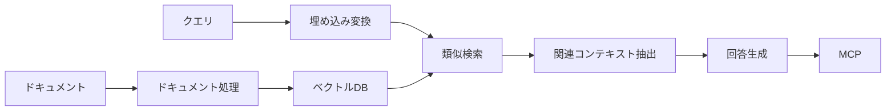
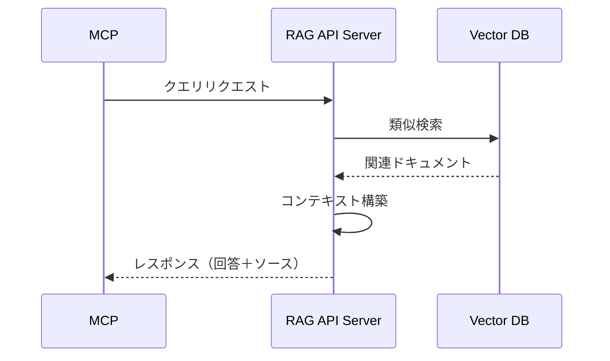

# RAG実装調査レポート：要約と推奨

## 目的

本レポートは、これまでの調査（001〜004）を総括し、ローカル環境でのRAGシステム構築に関する最終的な推奨事項をまとめたものです。

## 1. 技術選定の変遷

当初はJavaScriptベースの実装方針でしたが、調査の過程でPythonベースの実装に変更しました。その主な理由は以下の通りです：

1. **エコシステムの成熟度**：Pythonは機械学習/NLPの分野で圧倒的に広いエコシステムを持っています
2. **ライブラリの豊富さ**：埋め込みモデルや類似検索に関する高性能ライブラリが豊富に存在します
3. **ドキュメントとサポート**：LangChainのPythonバージョンはより充実したドキュメントとコミュニティサポートを持っています

## 2. 最終的な技術スタック

### 2.1 基本アーキテクチャ



### 2.2 選定した技術スタック

| コンポーネント | 選定技術 | 選定理由 |
|--------------|---------|---------|
| **フレームワーク** | LangChain (Python) | 機能の豊富さ、エコシステムの成熟度、統合の容易さ |
| **埋め込みモデル** | [pfnet/plamo-embedding-1b](https://huggingface.co/pfnet/plamo-embedding-1b/blob/main/README_ja.md) | 日本語サポート、ローカル実行の容易さ、高品質な埋め込み |
| **ベクトルDB** | ChromaDB | シンプルな導入、メタデータ対応、ローカル実行の容易さ |
| **ドキュメント処理** | LangChainローダー/スプリッター | 多様なフォーマット対応、日本語対応の分割機能 |
| **APIサーバー** | FastAPI | 高速、非同期対応、ドキュメント自動生成 |

### 2.3 具体的なパッケージとバージョン

```
langchain>=0.2.0
langchain-text-splitters
langchain-community
sentence-transformers
chromadb
fastapi
uvicorn
pydantic
```

## 3. 実装方針

### 3.1 ドキュメント処理フロー

1. **収集**：プロジェクト内のMarkdown、PDF、テキストファイル等をロード
2. **分割**：日本語対応のテキスト分割で適切なチャンクサイズに分割
3. **埋め込み**：pfnet/plamo-embedding-1bモデルによる埋め込みベクトル生成
4. **保存**：ChromaDBへの保存とインデックス化

### 3.2 クエリ処理フロー

1. **クエリ変換**：ユーザークエリを埋め込みベクトルに変換
2. **検索**：ベクトルDB内での類似度検索
3. **コンテキスト生成**：検索結果からの適切なコンテキスト構築
4. **回答生成**：LLMによる高品質な回答生成

### 3.3 MCPとの連携方法

RESTful APIを介した連携を推奨します：



## 4. 特に注目すべき実装ポイント

### 4.1 日本語処理の最適化

- **分割ロジック**：日本語のトークン化に適した分割方法（句点「。」や読点「、」での区切り）
- **埋め込みモデル**：日本語に強いモデルの選定（推奨: `paraphrase-multilingual-MiniLM-L12-v2` または `BAAI/bge-small-ja`）
- **検索パラメータ**：日本語テキストの特性に合わせた検索パラメータ調整

### 4.2 パフォーマンス最適化

- **バッチ処理**：大量ドキュメント処理時のメモリ効率化
- **キャッシュ機構**：頻出クエリに対する結果キャッシング
- **モデル最適化**：埋め込みモデルの量子化や最適化による推論速度向上

### 4.3 セキュリティ対策

- **入力検証**：クエリのサニタイズによるインジェクション対策
- **認証機構**：APIエンドポイントへのアクセス制御
- **センシティブ情報検出**：機密情報の漏洩防止対策

## 5. 実装手順の概略

1. **環境準備**
   - Pythonとパッケージのインストール
   - 必要なディレクトリ構造の構築

2. **ドキュメント処理システム実装**
   - ドキュメントローダーの実装
   - テキスト分割処理の実装
   - 埋め込み処理の実装

3. **ベクトルストア構築**
   - ChromaDBの初期化と設定
   - インデックス生成処理の実装

4. **クエリ処理システム実装**
   - ベクトル検索機能の実装
   - コンテキスト構築ロジックの実装
   - （オプション）回答生成機能の実装

5. **API実装**
   - FastAPIを用いたエンドポイント実装
   - リクエスト/レスポンスモデルの定義
   - エラーハンドリングの実装

6. **テストとデプロイ**
   - ユニットテストの実装
   - 統合テストの実装
   - デプロイ設定の構築

## 6. 推奨される実装コード

詳細は `004-Python版RAG実装の技術選定.md` を参照してください。以下はコアとなる実装例です：

```python
# 埋め込みモデルの初期化
from langchain_community.embeddings import HuggingFaceEmbeddings

embeddings = HuggingFaceEmbeddings(
    model_name="BAAI/bge-small-ja",
    model_kwargs={"device": "cpu"}
)

# ドキュメント処理
from langchain_text_splitters import RecursiveCharacterTextSplitter
from langchain_community.document_loaders import DirectoryLoader

loader = DirectoryLoader("./docs", glob="**/*.md")
documents = loader.load()

splitter = RecursiveCharacterTextSplitter(
    chunk_size=1000,
    chunk_overlap=200,
    separators=["\n\n", "\n", "。", "、", " ", ""]
)
chunks = splitter.split_documents(documents)

# ベクトルストア構築
from langchain_community.vectorstores import Chroma

vectorstore = Chroma.from_documents(
    documents=chunks,
    embedding=embeddings,
    persist_directory="./chroma_db"
)

# クエリ処理
results = vectorstore.similarity_search(
    "プロジェクトの構成について教えてください",
    k=4
)

# レスポンス構築
sources = []
for doc in results:
    sources.append({
        "title": doc.metadata.get("source", "Unknown"),
        "content": doc.page_content
    })

# APIレスポンス
response = {
    "answer": "生成される回答",
    "sources": sources
}
```

## 7. 残された課題と今後の展望

1. **埋め込みモデル評価**
   - 各種日本語モデルのベンチマーク比較
   - プロジェクト固有データに対する精度評価

2. **MCPとの統合検証**
   - 実際のMCP環境での動作テスト
   - レイテンシとスループットの評価

3. **コードベース管理**
   - 継続的インテグレーション/デプロイの設定
   - ドキュメント更新時の自動インデックス構築

4. **拡張機能の開発**
   - プロジェクト固有の知識に基づくクエリ前処理
   - 回答品質の評価機構

## 8. 実装スケジュール案

| フェーズ | 内容 | 期間 |
|---------|------|------|
| **PoC** | 基本機能の実装と検証 | 2週間 |
| **α版** | コア機能の実装とテスト | 3週間 |
| **β版** | MCP連携とユーザーテスト | 3週間 |
| **本番準備** | パフォーマンス最適化、セキュリティ強化 | 2週間 |
| **リリース** | 本番環境へのデプロイと監視 | 1週間 |

## 9. リソース要件

### 9.1 人的リソース

- **バックエンド開発者**: Pythonとベクトル検索に精通した開発者
- **MLエンジニア**: 埋め込みモデルとLLMに精通したエンジニア
- **インフラ担当**: デプロイと運用を担当するエンジニア

### 9.2 ハードウェア要件

- **開発環境**: 16GB以上のRAMを搭載したローカルマシン（理想的には32GB）
- **本番環境**: 16GBのRAM、4vCPU以上のサーバー
- **ストレージ**: プロジェクトドキュメントとベクトルインデックス用に最低20GB

## 10. 結論と提言

本調査を通じて、ローカル環境でのRAGシステム構築にはPythonベースのLangChain、pfnet/plamo-embedding-1b、ChromaDBの組み合わせが最適であることが明らかになりました。この技術スタックは以下の利点を提供します：

1. **シンプルな実装**: 既存のライブラリを活用した迅速な開発
2. **柔軟性**: さまざまなドキュメント形式や言語に対応可能
3. **拡張性**: 将来的な機能拡張に対応できるアーキテクチャ

プロジェクト固有ドキュメントを活用したMCPの強化は、開発者の生産性向上に大きく貢献する可能性があります。早期にプロトタイプを構築し、実際のプロジェクト環境での有効性を検証することを推奨します。

## 参考文献

1. [LangChain公式ドキュメント](https://python.langchain.com/docs/)
2. [pfnet/plamo-embedding-1b公式ドキュメント](https://www.sbert.net/)
3. [ChromaDB公式ドキュメント](https://docs.trychroma.com/)
4. [FastAPI公式ドキュメント](https://fastapi.tiangolo.com/)
5. [Hugging Face Embeddings](https://huggingface.co/models?sort=downloads&search=embeddings)
